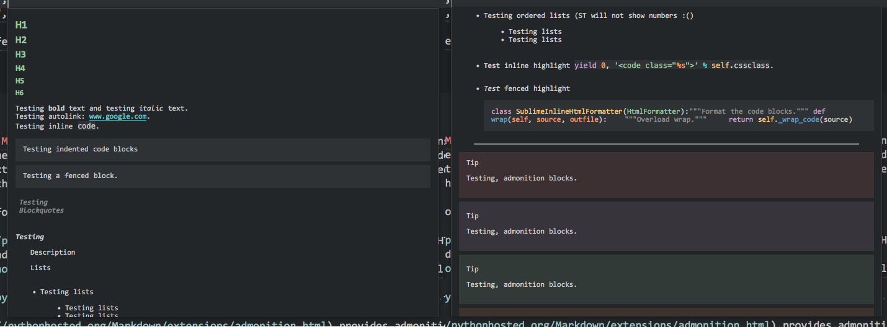

# Sublime Markdown Popups {: .doctitle}
Popup tooltips for Sublime generated with Markdown.

---

## Overview
Sublime Markdown Popups (mdpopups) is a library for Sublime Text plugins.  It utilizes the new plugin API found in ST3 Beta 3080+ for generating tooltip popups. It also provides API methods for generating and styling the new phantom elements introduced in ST3 Beta 3118+.  Mdpopups utilizes Python Markdown with a couple of special extensions to convert Markdown to HTML that can be used to create the popups and/or phantoms.  It also provides a number of other helpful API commands to aid in creating great tooltips and phantoms.

Mdpopups will use your color scheme to create popups/phantoms that fit your editors look.

## Features

- Can take Markdown or HTML and create nice looking popup tooltips and phantoms.
- Dynamically creates popup and phantom themes from your current Sublime color scheme.
- Can create syntax highlighed code blocks easily using either Pygments or the built-in Sublime Text syntax highlighter automatically in the Markdown environment or outside via API calls.
- Can create color preview boxes via API calls.
- A CSS template environment that allows users to override and tweak the overall look of the tooltip and phantom themes to better fit their preferred look.  Using the template filters, users can generically access color scheme colors and manipulate them.
- Plugins can extend the current CSS to inject plugin specific class styling.  Extended CSS will be run through the template environment.
